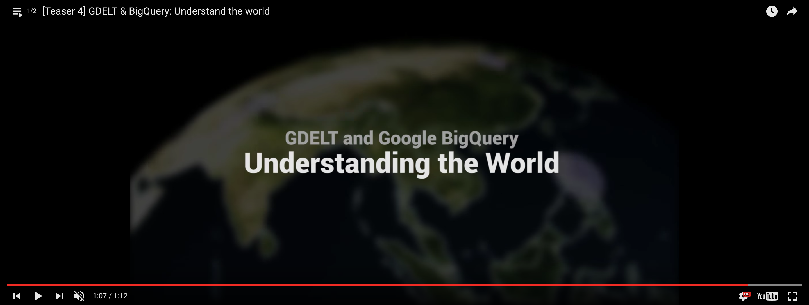
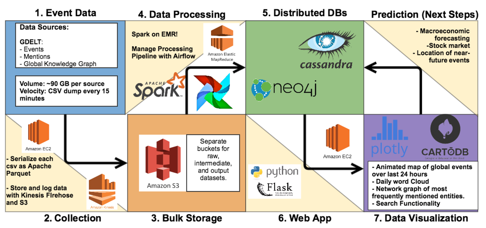

# GDELT: Global Data on Events, Location, and Tone
## Data Engineering Project for GalanvanizeU
==============================

About
------------

[](https://www.youtube.com/embed/GpCarC_I3Ao?list=PLlRVXVT7h9_gCGCOl_bNYHA7FXbSOIVbs "gdelt intro")

### Events: 
The GDELT Event Database records over **300 categories of physical activities around the world**, from riots and protests to peace appeals and diplomatic exchanges, georeferenced to the city or mountaintop, across the entire planet dating back to January 1, 1979 and updated every 15 minutes.

**Essentially it takes a sentence like _"The United States criticized Russia yesterday for deploying its troops in Crimea, in which a recent clash with its soldiers left 10 civilians injured"_** ...

and transforms this blurb of unstructured text into three structured database entries, recording **US CRITICIZES RUSSIA, RUSSIA TROOP-DEPLOY UKRAINE (CRIMEA), and RUSSIA MATERIAL-CONFLICT CIVILIANS (CRIMEA).**

Nearly **60 attributes are captured for each event**, including the approximate location of the action and those involved. This translates the textual descriptions of world events captured in the news media into codified entries in a grand "global spreadsheet."

### Global Knowledge Graph:
Much of the true insight captured in the world's news media lies not in what it says, but the context of how it says it. The GDELT Global Knowledge Graph **(GKG) compiles a list of every person, organization, company, location and several million themes and thousands of emotions from every news report**, using some of the most sophisticated named entity and geocoding algorithms in existance, designed specifically for the noisy and ungrammatical world that is the world's news media.

The resulting network diagram constructs a graph over the entire world, **encoding not only what's happening, but what its context is, who's involved, and how the world is feeling about it, updated every 15 minutes.**

Current Architecture
------------


Proposed Future Architecture
------------



Rationale of Architecture
------------
### Why Redshift, Cassandra, Neo4j?
- **Redshift is a distributed, scalable, relational database that integrates really nicely with Spark.**
- Cassandra is a distributed NOSQL database that is column orientd. GDELT is a dataset that is begging to be integrated with other datasources. Cassandra would be good for adding attributes and metadata to subsets of event/records.
- Neo4j is a graph database. It would be helpful for updating pagerank and edge links.

How does my system have this property?
How does my system fall short and how could it be improved?

### Robustness and Fault Tolerance

- **Logs**

- My system hinges on two EC2 instances, and an EMR cluster. I may look into using Elastic Beanstalk to deploy fresh EC2 instances in the event that one fails. 

### Low latency reads and updates

- ** Apache Parquet, EMR, Redshift **
- **Dev ops techniques to enforce environment variables, ship and sync scripts to virtual machines.**

- My system does not consider how to lower latency reads between my flask app and my distributed data stores. However, I will serialize each CSV as an Apache Parquet file which will make data processing in Spark faster. 


### Scalability

- ** EMR and Redshift are easily scalable.**

- Again, I may need to look into Elastic Beanstalk to enable automated scaling for other components of the pipeline such as standalone EC2s.

### Genaralization

- ** All file states (raw, interim, processed) stored in S3 **
- I hope to use Airflow to coordinate my Spark DAGs. This would make it easier to do future projects that entail prediction and machine learning. It would be nice to enable queries in the web app that trigger a Spark job that returns an answer. Elastic Search may be worth investigating.

### Extensibility

- **Saving my raw files onto S3 and extensive modularization of Spark code makes this system somewhat extensible.**
- Work on Makefiles and automating environment setup

### Ad Hoc Queries

- ** Need to login to Spark EMR to do ad-hoc processing. Some tables in Redshift for ad-hoc querying.**
- Elastic Search combined with Spark would be a great way to perform efficient ad hoc queries.

### Minimal Maintenance

- **EMR and Redshift minimize maintenance.**
- EC2 instances need continual maintenance. Could be improved with EBS

### Debuggability

- **Heavy use of logging module.**
- Store all the logs on S3.
- Airflow would help with debuggability.


Project Organization
------------

    ├── LICENSE
    ├── README.md          <- The top-level README for developers using this project.
    ├── data               <- Bucket to hold data created by ./src/get_gdelt.py
    │   ├── external       <- Data from third party sources.
    │   ├── interim        <- Intermediate data that has been transformed.
    │   ├── processed      <- The final, canonical data sets for modeling.
    │   └── raw            <- The original, immutable data dump.
    │
    ├── notebooks          <- Jupyter notebooks. 
    │   ├── GDELT_Architecture.ipynb <- overview of architecture and data demo.
    │
    ├── reports            <- Generated analysis as HTML, PDF, LaTeX, etc.
    │   ├── example_report.html <- Example output of Spark analysis that sits on S3.
    │
    ├── requirements.txt   <- The requirements file for reproducing the analysis environment, e.g.
    │                         create with `pip freeze > requirements.txt`,  
    |                         execute with "sudo `which pip` install -r requirements.txt"
    │
    ├── src                <- Source code for use in this project.
    │   ├── __init__.py    <- Makes src a Python module
    |   ├── spinup_ec2.sh  <- Launches an rx.large EC2 instance.
    |   ├── bootstrap_ec2.sh <- Install dependencies on EC2
    │   │
    │   ├── data           <- Scripts to download or generate data
    │   │   └── get_gdelt.py <- Requests most recent batch of gdelt data and saves to S3 as parquet. [AWS EC2]
    │   │   └── gkg_cooccurences_pyspark.py <-Spark processing and output analysis to S3 and Redshift. [AWS EMR & Redshift]

--------

<p><small>Project based on the <a target="_blank" href="https://drivendata.github.io/cookiecutter-data-science/">cookiecutter data science project template</a>. #cookiecutterdatascience</small></p>


Setup
------------

1. Spinup an EC2 instance for extracting data.
```bash
    $ python PROJ_ROOT/src/spinup_ec2.sh
```
2. Install Dependencies:
```bash
    $ bash PROJ_ROOT/src/bootstrap_ec2.sh
    $ sudo `which pip` install -r PROJ_ROOT/requirements.txt
    $ aws configure
```
3. Extract, Transform, Load:
```bash
    $ python PROJ_ROOT/src/get_gdelt.py
    $ python src/get_gdelt.py
```
